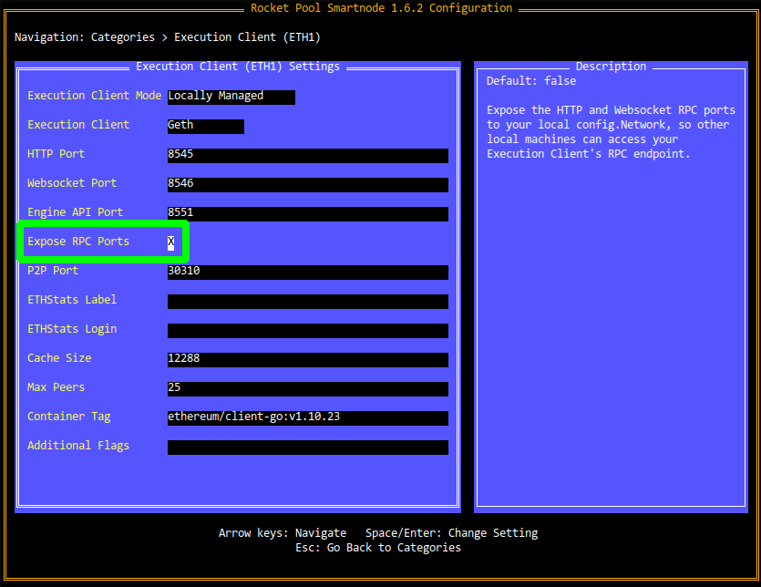
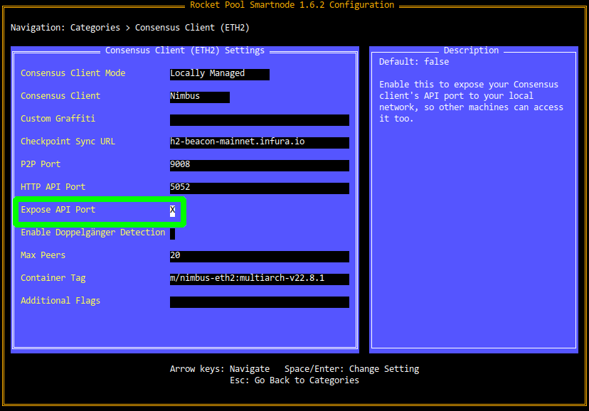
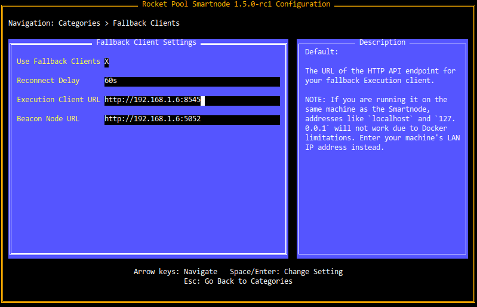

# Specifying a Fallback Node

Starting with **1.5.0** of the Smartnode stack, you can provide a "fallback" Execution client and Consensus client pair that can take over for your primary clients if they ever go offline (such as because [you use Geth and need to prune it](./pruning)).
In this situation, your primary node machine will still be responsible for attesting and proposing blocks with your minipools' validator keys, but it will connect to an external machine to interact with the Execution layer and Beacon chains.

Essentially, it allows you to _temporarily_ use another pair of clients for things like querying the chains, sending transactions, and receiving blocks to attest to.
This pair can be externally managed (like Hybrid mode), or it can be another Rocket Pool node (another Docker mode machine that has the API ports exposed, which we'll cover below).

Once your node's primary clients are back online, the Smartnode and your Validator client will switch back to them automatically.

::: warning NOTE
A fallback node is **not** the same as a "backup" node.
Fallback nodes have an Execution and Consensus client pair synced to the chain and running, but they **do not** have your node's wallet or its validator keys loaded.

If your main node ever goes offline, **your fallback will not start validating for you.**
:::

## Supported Clients

As of v1.9.0, all our supported validator clients have added Fallback support with only a few limitations:

| Name       | Supports Fallback | Valid Fallback Clients                                                       |
| ---------- | ----------------- | ---------------------------------------------------------------------------- |
| Lighthouse | Yes               | Any (doppelganger protection off)<br>Lighthouse (doppelganger protection on) |
| Nimbus     | Yes               | Any                                                                          |
| Prysm      | Yes               | Prysm                                                                        |
| Teku       | Yes               | Any                                                                          |
| Lodestar   | Yes               | Any                                                                          |

## Setting up a New Node (Docker Mode)

You can use a 2nd machine that you own locally, a remote node hosted on a VPS, or a cloud-based node as a fallback node.

This example shows you how to create a 2nd Smartnode on a different machine using Docker mode, which can serve as a fallback node.

::: tip TIP
If you already have a 2nd node ready and have its RPC ports exposed, feel free to skip this section.
:::

1. Follow the steps in the guide on setting up a node ([local](./local/hardware) or [remote](./vps/providers)).
2. Once the machine is ready, [install the Smartnode stack](./docker).
3. Run `rocketpool service config` to specify which clients you'd like to use.

   1. When you get to the end of the wizard and it asks if you'd like to review your settings, select **Yes**.
   2. Enter the `Execution Client` settings.
   3. Check the `Expose RPC Ports` box:

   { style="display: block; margin: 0 auto" }

   4. Go back and enter the `Consensus Client` settings.
   5. Check the `Expose API Port` box (and, if you're using **Prysm**, the `Expose RPC Port` box as well):

   { style="display: block; margin: 0 auto" }

   6. Save the settings and start the Smartnode.

4. Skip to the [Securing your Node](./securing-your-node) guide to set up SSH and the proper security posture on it.

   1. If you have `ufw` installed, you will need to add rules to allow incoming traffic to the API ports (`8545`, `8546`, and `5052` by default; also `5053` if you're using **Prysm**).

5. That's it! You can stop here.

::: danger NOTE
**Do not** create a wallet with `rocketpool wallet init` or recover your old wallet.
Leave this node without a wallet and without validator keys.

Its only job is to have a synced Execution client and Consensus client.
:::

## Connecting your Main Node to the Fallback Node

Once you have a fallback node prepared, you can connect it to your main node.

1. Enter the `rocketpool service config` TUI and enter the `Fallback Clients` settings.
2. Check the `Use Fallback Clients` box.
3. Enter the RPC URL for your Execution client in the `Execution Client URL` box. For example, if your fallback node's IP address is `192.168.1.45` and you have its Execution client on the default port of `8545`, you would enter `http://192.168.1.45:8545` here.
4. Do the same for the RPC URL of your fallback Consensus client. Following the same example, if you have it on the default port of `5052`, you would enter `http://192.168.1.45:5052` here.

The final page should look like this:

{ style="display: block; margin: 0 auto" }

::: tip NOTE
**Native mode** users can follow the same steps, though the TUI will look slightly different from the above screenshot.

Note that this will only provide the **Smartnode itself** (the daemon service) with fallback support; **you will have to update your Validator client service's arguments manually to give it access to the fallback clients.**
:::

Press `enter` on the final box to ensure that it's confirmed, then save the settings and apply the changes.

Once they've been applied, you can confirm the availability of your fallback node using the `rocketpool node sync` command:

```
Your Smartnode is currently using the Ethereum Mainnet.

Your eth2 client is on the correct network.

Your primary execution client is fully synced.
Your fallback execution client is fully synced.
Your primary consensus client is fully synced.
Your fallback consensus client is fully synced.
```

If it shows that both the fallback Execution and Consensus client are synced, then you're all set!

## Testing the Fallback Clients

If you'd like to be absolutely sure that your configuration is going to work by testing the fallback clients, simply stop the Execution and Consensus clients on your main node:

```shell
docker stop rocketpool_eth1 rocketpool_eth2
```

Then run any command that queries the chain, such as `rocketpool network stats`.
You will see a warning message at the top indicating that one (or both) of your primary clients are offline, and that it's reverting to the fallback clients:

```
NOTE: primary clients are not ready, using fallback clients...
	Primary EC status: unavailable (Sync progress check failed with [Post "http://eth1:8545": dial tcp: lookup eth1 on 127.0.0.11:53: no such host])
	Primary CC status: synced and ready

========== General Stats ==========
Total Value Locked:      278978.009858 ETH
Staking Pool Balance:    10.587295 ETH
Minipool Queue Demand:   3360.000000 ETH
Staking Pool ETH Used:   99.735490%

============== Nodes ==============
Current Commission Rate: 15.000000%
Node Count:              1325
Active Minipools:        6409
    Initialized:         175
    Prelaunch:           3
    Staking:             6227
    Withdrawable:        0
    Dissolved:           4
Inactive Minipools:      0

========== Smoothing Pool =========
Nodes Opted in:          0
Pending Balance:         0.000000

============== Tokens =============
rETH Price (ETH / rETH): 1.031919 ETH
RPL Price (ETH / RPL):   0.011563 ETH
Total RPL staked:        6098920.170527 RPL
Effective RPL staked:    5751692.043848 RPL
```

Finally, start your primary clients again:

```shell
docker start rocketpool_eth1 rocketpool_eth2
```

And you're done!
Your fallback setup is working.

## Next Steps

Whether or not you've opted into creating and/or running a fallback node for your setup, the next step is to learn about **priority fees**.
Click on the next section of the guide when you're ready to proceed.
